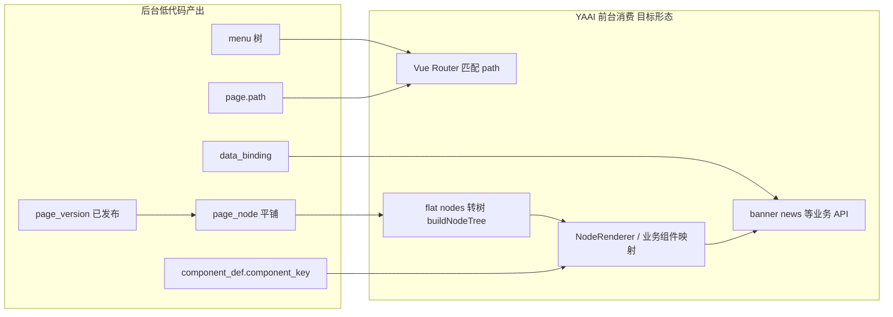

# YAAI 前台结构映射分析

> 扫描范围（只读）：`YAAI/src/router`、`views`、`components`、`api`、`types`、`doc`。  
> 本文描述成员 4 当前官网前端的**静态路由与展示结构**，供后台低代码产出 `menu` / `page` / `page_version` / `page_node` / `component_key` 时对齐。

---

## 1. YAAI 前台路由概览

路由入口：`YAAI/src/router/index.ts`。

| 路径模式 | 路由名（节选） | 布局 / 说明 |
|----------|----------------|-------------|
| `/` | `Home` | 全站 Header + Navbar + Footer，主体为 `views/home/Index.vue` |
| `/services` | `Services` | 同上，服务矩阵页 |
| `/conference` 及子路径 `past` / `submit` / `guide` / `detail/:id` | `Conference*` 等 | 当前子路由均落在**同一** `conference/Index.vue` |
| `/about/*` | `AboutIntroduction` 等 | **父级** `SidebarLayout`，`props: { groupKey: 'about' }`；子路径见下 |
| `/news/*` | `NewsIndex`、`NewsCategoryList` 等 | **父级** `SidebarLayout`，`groupKey: 'news'` |
| `/content/:id` | `ContentDetail` | 通用内容详情（由 `ContentDetail.vue` 拉取新闻详情等） |
| `/news/article/:id` | — | **重定向**至 `/content/:id` |
| `/apply`、`/apply/:step` | `Apply` | 多步骤申请表单 |
| `/login` | `Login` | 登录（无顶栏底栏 chrome） |
| `/user` | `UserCenter` | 用户中心（无 chrome） |

**关于我们（`/about` 子路由，静态侧栏来源 `config/sidebar.ts`）**

- `/about/introduction` — 学会简介  
- `/about/charter` — 学会章程  
- `/about/regulations` — 条例与制度  
- `/about/leaders` — 主要领导  
- `/about/branches` — 分支机构  
- `/about/local` — 地方学会  

**新闻动态（`/news`）**

- `/news` — 入口为 `NewsRedirect.vue`（重定向/聚合逻辑）  
- `/news/c/:categoryId(\\d+)` — 分类列表（**数字 id**）  
- 若干旧路径 `politics` / `tech` 等 **redirect 到 `/news`**  

**关键结论（给 `page.path` 设计）**

- 展示端路由以 **Vue Router 已注册 path** 为准；动态门户若要以「配置驱动单页」接后台，成员 4 需增加 **通配或动态页**（见 [前台接入后台低代码说明.md](./前台接入后台低代码说明.md)）；在未改前台前，`page.path` 应优先与**现有** path 一致，避免菜单点击 404。

---

## 2. YAAI 前台组件与展示结构概览

### 2.1 全站布局（`App.vue`）

- 常规页：`Header`、`Navbar`、`Footer` + `<router-view />`  
- `/login`、`/user`：**隐藏** Header / Navbar / Footer  

### 2.2 主导航（`components/layout/Navbar.vue`）

与顶部导航一致的意图结构（实现上含下拉与外链占位）：

- 首页 → `/`  
- 关于云智会 → `/about/introduction`（下拉子链至各 about 子页）  
- 服务矩阵 → `/services`（下拉多条目前指向同一路径）  
- 新闻动态 → `/news`（下拉项来自 **`newsCategory` store**：`/news/c/{id}`）  
- 会议系统 → `/conference`  

### 2.3 侧栏布局（`components/layout/SidebarLayout.vue`）

- `groupKey === 'about'`：`sidebarGroups.about` 静态项  
- `groupKey === 'news'`：侧栏项由 **`GET` 启用新闻分类** 动态生成（与顶栏下拉同源）  

### 2.4 首页拼装（`views/home/Index.vue`）

首页由多个 **section 子组件** 纵向组合（非单一「动态节点树」）：

| 区域 | 组件路径 | 职责概要 |
|------|-----------|----------|
| Hero 轮播 | `views/home/sections/HomeCarousel.vue` | 轮播展示（脚本内拉取 banners 等） |
| 通知 + 快捷入口 | `HomeNotice`、`HomeQuickLinks` | 通知列表、快捷链接 |
| 服务矩阵 | `HomeServices` | 服务入口网格 |
| 活动预告 | `HomeEvents` | 活动/会议类列表展示 |
| 新闻公告 | `HomeNews` | 新闻列表区块 |
| 快捷导航 | `HomeShortcuts` | 站内快捷入口 |
| 友情链接 | `HomeFriendLinks` | 友链 |

### 2.5 通用内容组件

- `components/common/ContentList.vue`、`ContentDetail.vue`、`Breadcrumbs.vue`  
- `components/about/AboutStaticArticle.vue` — 关于页静态文章壳  

### 2.6 前台 API 模块（`src/api`）

现有模块：`banner`、`news`、`newsCategory`、`member`、`memberArchive`、`common`、`user`、`sysMessage` 等。低代码 **`data_binding.source_key` / `query_json`** 将来需与这些**业务接口语义**对齐（具体字段以 `YAAI/doc` 与后端契约为准）。

---

## 3. 可映射 `component_key` 建议表

**正式白名单已冻结**：见 [component_key白名单.md](../01_设计基线/component_key白名单.md)。下表为与 YAAI 区块的对应关系（与《前台接入》及 mock 中已出现键一致；**不再保留二选一**）。

| 正式 `component_key` | 对应 YAAI 现有区域 / 组件 | 说明 |
|----------------------|---------------------------|------|
| `page_container` | 页面根容器 | 根容器 |
| `hero_banner` | `HomeCarousel` | 轮播；常与 banner 接口 + `data_binding` |
| `notice_list` | `HomeNotice` | 通知公告 |
| `quick_links` | `HomeQuickLinks` | 快捷入口 |
| `home_services` | `HomeServices` | 服务矩阵 |
| `home_events` | `HomeEvents` | 活动预告 |
| `news_list` | `HomeNews` | 新闻列表 |
| `home_shortcuts` | `HomeShortcuts` | 快捷导航 |
| `friend_links` | `HomeFriendLinks` | 友情链接 |
| `rich_text` | `AboutStaticArticle` / 文章区块 | 富文本 |

**历史别名（不用于新配置）**：`service_matrix`、`event_list` —— 存量数据应迁移到 `home_services`、`home_events`（见清洗文档）。

**补充（布局实现细节，非独立业务白名单键）**：mock/编辑器中可能出现的 `hero_split_container` 等仅用于**嵌套布局**，与「首页 8 区块」业务键分离；面向成员 4 交付时以 **`page_container` + 子节点 / 槽位** 表达版式。

**不适合**强行映射到单一 `component_key` 的区块：

- **整页侧栏+面包屑**：由 `SidebarLayout` + 路由元信息驱动；更适合保留为前台固定布局 + 子区一条 `router-view`，或用 `groupKey` 约定，而非盲目塞进 `page_node` 第一屏。

---

## 4. 后台低代码与前台展示的连接关系

- **当前 YAAI 实现**：多数页面为 **手写 Vue 页**，数据来自 **REST**，**未**统一走 `GET /page-versions/{id}/node-tree`。  
- **目标形态**（契约见 [前台接入后台低代码说明.md](./前台接入后台低代码说明.md)）：菜单 → `page.path` → 解析 `current_version_id` → 拉 node-tree → `component_key` 映射前台组件。

---

## 5. 成员 4 只读消费的数据流（推荐）

与仓库内文档一致，前台最小链路为：

1. `GET /menus` → `buildMenuTree`（与低代码 `utils/tree.ts` 同源思路：`parent_id` + `sort_order`）  
2. 点击菜单 → 路由进入 `page.path`  
3. `GET /pages` 或按 path 查 page → 取 `currentVersionId`（或字段等价）  
4. `GET /page-versions/{versionId}/node-tree` → 得平铺 `nodes`  
5. `buildNodeTree` → 递归渲染；未知 `component_key` **降级**不崩溃  

响应 **camelCase** / **records** 等差异见 [接口字段差异记录.md](../01_设计基线/接口字段差异记录.md)（适配在成员 4 或公共 SDK 层完成，不在本文展开）。

---

## 6. 对本节分析的回答摘要（对应协作问答 1～4）

1. **主要页面与路由**：首页、服务、会议（及子路径）、关于我们 6 子页、新闻（列表+分类+详情）、申请、登录、用户中心；详情主要走 `/content/:id`。  
2. **可复用展示组件**：布局（Header/Navbar/Footer/SidebarLayout）、通用（ContentList/ContentDetail/Breadcrumbs）、首页 8 个 section 子组件、关于页静态壳等。  
3. **适合映射成 `component_key` 的**：首页各区块、富文本块、列表类（新闻/通知）、轮播；侧栏/面包屑更适合布局层而非原子组件。  
4. **命名建议**：全小写 **snake_case**，与 `component_def.component_key` 及《前台接入》示例表一致，避免与现有 Vue 文件名混用；成员 4 在 `component-map.ts` 中集中映射。

---

*文档版本：与仓库当期只读扫描一致；若 YAAI 路由变更，请以 `YAAI/src/router/index.ts` 为准更新本节。*
